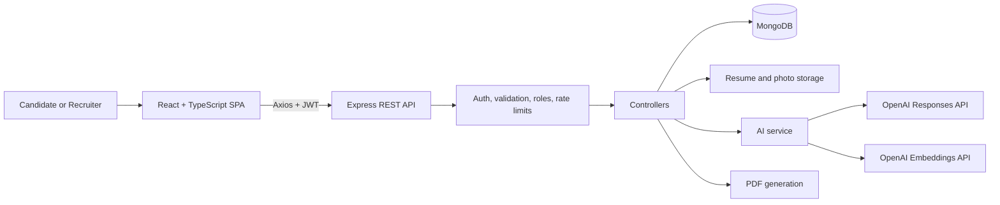
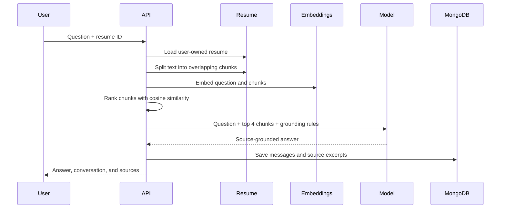

# CareerPilot AI — Full-Stack and AI Interview Guide

Use this document to explain the project in an interview. Do not memorize every sentence. Learn the architecture, understand the main request flows, and explain the trade-offs in your own words.

## 1. One-line project description

CareerPilot AI is a production-style MERN career platform that combines resume analysis, semantic job matching, grounded resume Q&A, cover-letter generation, interview coaching, coding feedback, application tracking, recruiter tools, and usage analytics.

## 2. 30-second introduction

> CareerPilot AI is a full-stack TypeScript application built with React, Node.js, Express, MongoDB, and the OpenAI API. A candidate can upload a resume, receive an ATS analysis, find jobs ranked through keyword and semantic matching, generate grounded cover letters, ask questions about the resume through a RAG workflow, and practice interviews or coding. Recruiters can publish jobs and review candidates. I designed the AI layer as a reusable backend service with structured outputs, deterministic demo fallbacks, usage tracking, and prompts that prevent invented candidate facts.

## 3. Two-minute explanation

> The frontend is a React 19 single-page application built with TypeScript and Vite. It has feature workspaces for resumes, jobs, applications, the AI assistant, cover letters, interviews, coding, profiles, dashboards, and recruiter workflows. Axios sends requests to a versioned Express API and automatically attaches the JWT access token.
>
> The backend uses Express 5 and TypeScript. Zod validates authentication input, middleware verifies JWTs and roles, Multer handles resume and photo uploads, and Mongoose persists the domain data in MongoDB. The main collections represent users, resumes, jobs, applications, interviews, conversations, cover letters, coding attempts, notifications, and AI usage.
>
> The AI integration is centralized in one service. It uses the OpenAI Responses API for text generation and JSON-schema structured outputs. It also uses an embedding model to represent resumes, jobs, and user questions as vectors. Job recommendations combine a deterministic ATS score with cosine similarity. The resume assistant implements RAG: it chunks the resume, embeds the question and chunks, retrieves the four most similar chunks, and sends only those excerpts to the model with grounding instructions.
>
> I also considered reliability and operations. The application records token usage, latency, success, model, user, and feature for each generation request. It sets `store: false`, keeps the API key on the server, provides a demo fallback when no API key is configured, rate-limits the API, and includes Docker Compose and Kubernetes examples.

## 4. Problem and solution

### Problem

Job seekers normally use separate products for resume review, job search, cover letters, interview practice, coding practice, and application tracking. This creates duplicated data and generic AI output with little knowledge of the candidate.

### Solution

CareerPilot keeps the candidate's resume and career workflow in one system. The same verified resume data supports:

- ATS scoring and resume improvement
- Job recommendations and match explanations
- Grounded assistant answers
- Job-specific cover letters
- Interview preparation
- Application and progress analytics

The important design idea is that AI is not a separate chatbot added to the UI. It is a backend capability connected to real domain data and normal CRUD workflows.

## 5. High-level architecture



### Responsibility of each layer

| Layer | Responsibility |
| --- | --- |
| React frontend | User experience, routing, forms, charts, API state, notifications |
| Axios client | Base URL, timeout, JWT attachment, centralized 401 handling |
| Express API | HTTP orchestration, authorization, validation, uploads, error handling |
| Controllers | Feature use cases and ownership checks |
| Services | Reusable OpenAI, embedding, ATS, parsing, chunking, and PDF logic |
| Mongoose models | Domain schema, indexes, relationships, persistence |
| MongoDB | Users, resumes, jobs, applications, AI results, conversations, usage |
| OpenAI | Generation, evaluation, structured results, vector embeddings |
| Docker/Kubernetes | Repeatable local and example production deployment |

## 6. Technology choices

### Frontend

- React 19 for component-based UI
- TypeScript for compile-time contracts
- Vite for development and optimized production builds
- React Router for SPA routes and protected application layout
- Axios for HTTP requests and interceptors
- Tailwind CSS for styling
- Recharts for dashboard visualizations
- React Hot Toast for user feedback
- Route-level lazy loading to reduce the initial JavaScript bundle

### Backend

- Node.js and Express 5 for the REST API
- TypeScript across frontend and backend
- MongoDB and Mongoose for document-oriented domain data
- Zod for request/environment validation
- JWT and bcrypt for authentication
- Multer for controlled file uploads
- `pdf-parse` and Mammoth for PDF/DOCX text extraction
- PDFKit for optimized resume export
- Helmet, CORS, rate limiting, Morgan, and centralized error middleware

### AI

- OpenAI Node SDK
- Responses API for generated text and evaluations
- JSON Schema Structured Outputs for predictable machine-readable results
- `text-embedding-3-small` by default for semantic representations
- Cosine similarity for local vector ranking
- Retrieval-augmented generation for grounded resume chat
- A deterministic ATS algorithm for explainability and fallback behavior

## 7. Repository structure

```text
careerpilot-ai/
├── frontend/
│   ├── src/api/          Axios configuration
│   ├── src/components/   Shared UI components
│   ├── src/context/      Authentication state
│   ├── src/hooks/        Reusable API-loading hook
│   ├── src/layouts/      Protected application shell
│   └── src/pages/        Product feature pages
├── backend/
│   ├── src/config/       Environment and MongoDB setup
│   ├── src/controllers/  Use-case orchestration
│   ├── src/middleware/   Auth, roles, validation, errors
│   ├── src/models/       Mongoose domain models
│   ├── src/routes/       REST endpoints and uploads
│   ├── src/services/     AI, ATS, document, embedding logic
│   ├── src/tests/        ATS tests
│   └── src/seed.ts       Realistic demonstration data
├── infra/                Kubernetes example
└── docker-compose.yml    MongoDB, API, and web containers
```

## 8. Core domain model

The application uses the following main MongoDB entities:

- `User`: identity, role, profile, experience, education, skills, photo, and resume URL
- `Resume`: extracted text, ATS scores, strengths, improvements, optimized text, and embedding
- `Job`: recruiter owner, description, skills, salary, work mode, status, and embedding
- `Application`: candidate, job, resume, pipeline status, notes, next action, and match score
- `Interview`: generated questions, submitted answers, evaluations, total score, and status
- `Conversation`: selected resume and persistent user/assistant messages with source excerpts
- `CoverLetter`: candidate, job/company/role, tone, and generated content
- `CodingAttempt`: challenge, language, submitted code, score, tests estimate, complexity, and feedback
- `Usage`: AI feature, model, token counts, latency, success, and user
- `Notification`: user messages and read state

MongoDB fits this project because several records contain nested data whose shape matches the UI, such as interview questions/answers, resume section scores, profile experience, and conversation messages. References are still used where entities have independent lifecycles, such as users, jobs, resumes, and applications.

## 9. Important end-to-end flows

### 9.1 Registration and login

```text
React form
  → POST /api/auth/register or /api/auth/login
  → Zod input validation
  → bcrypt hash/compare
  → MongoDB user lookup/create
  → signed JWT returned
  → frontend stores token
  → Axios sends Authorization: Bearer <token>
  → auth middleware verifies token and loads user
```

Google login sends the Google credential to the backend. The backend validates it against Google's token information endpoint, verifies audience, email status, and expiry, and then finds or creates the user.

### 9.2 Resume upload and analysis

```text
PDF/DOCX/TXT upload
  → Multer file validation and size limit
  → PDF parser, Mammoth, or UTF-8 extraction
  → deterministic ATS calculation
  → OpenAI resume enrichment
  → resume embedding creation
  → MongoDB persistence
  → analysis displayed in Resume Studio
```

The deterministic ATS calculation evaluates:

- Contact information
- Summary/profile section
- Experience section
- Education section
- Skills section
- Numeric impact statements
- Matched and missing target-job keywords

The final ATS score is currently:

```text
55% document structure + 45% target keyword coverage
```

The score is capped at 98 because it is a heuristic, not a guarantee of acceptance by a real ATS.

### 9.3 Hybrid job matching

The job match combines lexical and semantic signals:

1. ATS analysis compares resume terms with the job description.
2. The resume and job embeddings capture semantic similarity.
3. Cosine similarity converts the vector relationship into a semantic score.
4. When embeddings exist, the combined score is:

```text
70% ATS score + 30% semantic similarity
```

This hybrid approach is more explainable than embeddings alone because the UI can show matched and missing keywords, while semantic similarity can recognize related meaning that exact keyword comparison misses.

### 9.4 RAG assistant

RAG means retrieval-augmented generation. It retrieves relevant source content before asking the language model to answer.



Implementation details:

- Chunk size: about 1,100 characters
- Overlap: about 180 characters
- Retrieval count: top four chunks
- Ranking: cosine similarity
- Prompt rule: answer only from retrieved excerpts and state when evidence is insufficient
- Source labels: `[Resume chunk N]`

Why overlap? A relevant sentence may cross a chunk boundary. Overlap reduces the chance that context is split and lost.

### 9.5 Structured interview generation and evaluation

Question generation uses a strict JSON schema containing:

- Question ID
- Question text
- Category
- Difficulty
- Expected topics

Answer evaluation also uses a schema containing:

- Score
- Feedback array
- Improved answer

Structured output is valuable because the controller can persist and render the result without brittle parsing of free-form prose.

### 9.6 Coding feedback

The user selects a challenge and language, writes code, and submits it to the API. The AI evaluates correctness, edge cases, readability, security, and time/space complexity, returning a structured score and feedback.

Important interview honesty: the current version does **not** compile or execute untrusted submissions against real tests. It performs model-based review. A production coding judge would need isolated containers, strict CPU/memory/time limits, language-specific runners, hidden test cases, and a queue.

### 9.7 Cover-letter generation

The controller loads a user-owned resume and optionally a stored job. It sends resume text, company, role, description, and requested tone to the model. System instructions require concise output and prohibit unsupported candidate claims. The result is persisted for later use.

### 9.8 Analytics

Dashboard analytics aggregate normal product data and AI usage data. Examples include application pipeline counts, latest ATS result, interview results, cover-letter count, conversation count, AI request count, and token totals. Recruiter analytics are protected by role-based authorization.

## 10. AI service design

All model generation goes through `generateAI<T>()` in `backend/src/services/ai.service.ts`.

It accepts:

- Feature name for observability
- User ID
- Developer instructions
- Input/context
- Optional JSON schema and schema name
- Deterministic fallback function

It then:

1. Checks whether an OpenAI client is configured.
2. Returns the feature fallback in demo mode when no key exists.
3. Creates a Responses API request with the configured model.
4. Adds a global truthfulness rule.
5. Sets `store: false`.
6. Adds strict JSON-schema formatting when required.
7. Extracts `response.output_text`.
8. Parses structured JSON when a schema was used.
9. Records tokens, latency, success, model, feature, and user.
10. Records failed requests before rethrowing errors.

This wrapper avoids duplicating security rules, observability, fallback logic, and response parsing across controllers.

## 11. Prompt-engineering approach

The project follows four useful prompt-design rules:

### Role and task

Each feature gives the model a focused role, such as senior ATS editor, strict coding reviewer, or source-grounded career assistant.

### Grounding

The model receives the relevant resume/job/question data instead of being asked to answer from general assumptions.

### Explicit constraints

The shared AI service adds a rule not to invent employment, education, skills, metrics, or credentials.

### Output contract

Features consumed programmatically use strict JSON schemas. User-facing prose, such as a cover letter or assistant answer, remains plain text.

## 12. Why this is AI engineering, not just an API call

The AI work includes:

- Choosing deterministic logic versus generative logic
- Extracting and cleaning source documents
- Chunking and retrieving relevant context
- Generating and storing embeddings
- Implementing cosine-similarity ranking
- Combining lexical and semantic signals
- Designing grounded prompts
- Defining strict output schemas
- Preventing unsupported resume claims
- Providing local fallback behavior
- Tracking tokens, latency, failures, users, and features
- Persisting AI results as part of product workflows

## 13. Security explanation

Implemented controls include:

- Password hashing with bcrypt cost factor 12
- Signed JWT authentication with configurable expiry
- Candidate, recruiter, and admin role checks
- Ownership filters when reading or changing resumes, jobs, and conversations
- Zod validation on authentication payloads
- File MIME/type and size restrictions
- OpenAI key stored only on the backend
- Helmet security headers
- Configurable CORS origins
- API rate limiting
- Request-body size limits
- Centralized error responses
- `store: false` on Responses API requests
- Environment files excluded from Git

Security improvements for a real production version:

- Prefer secure, HTTP-only, SameSite cookies over localStorage for browser tokens
- Add refresh-token rotation and revocation
- Validate more endpoint payloads with Zod, not only authentication
- Add antivirus/content scanning for uploads
- Store uploads in private object storage with signed URLs
- Add CSRF controls if cookie authentication is introduced
- Add audit logs, secret rotation, CSP tuning, and abuse monitoring
- Use transactions where multi-document consistency is important

## 14. Reliability and observability

Current reliability features:

- Central async error handling
- Health endpoint
- MongoDB connection lifecycle handling
- API timeouts on the frontend
- AI success/failure and latency records
- Token-usage analytics
- Demo fallback without an OpenAI key
- Docker health check for MongoDB
- Unit tests for ATS keyword/scoring behavior

Production improvements:

- Structured logs with correlation/request IDs
- Metrics and tracing through an observability platform
- Retries with exponential backoff for safe transient AI failures
- Idempotency keys for expensive creation endpoints
- Queues for document processing and long AI requests
- Caching for embeddings and repeated recommendations
- SLOs and alerts for latency, error rate, and AI spend
- Broader controller/integration/E2E test coverage

## 15. Performance and scalability

### Current optimizations

- Route-level frontend lazy loading
- MongoDB indexes and limited query result sets
- Parallel work with `Promise.all` where operations are independent
- Resume/job embeddings persisted for reuse
- Keyword matching performed locally
- Uploaded file and request-body limits

### Current RAG limitation

The assistant re-chunks the resume and creates embeddings for every chunk during each question. This is simple and works for a demonstration, but it increases latency and cost.

### Production RAG design

1. Chunk the resume once during upload.
2. Embed each chunk once.
3. Store vectors and metadata in a vector index.
4. Embed only the new question at query time.
5. Run top-k vector search with a user/resume metadata filter.
6. Optionally rerank results.
7. Cache repeated queries and evaluate retrieval quality.

For larger scale, use MongoDB Atlas Vector Search or a dedicated vector database instead of loading and comparing all vectors in application memory.

## 16. Deployment story

Docker Compose defines three services:

- MongoDB 7 with a persistent volume and health check
- Express backend with uploads persisted in a volume
- React production build served by Nginx

The repository also includes a Kubernetes example. In a production cloud deployment, I would add managed MongoDB, private object storage, a secrets manager, TLS ingress, autoscaling, centralized logs, monitoring, backups, and CI/CD checks.

## 17. Main trade-offs and why they were chosen

### REST instead of GraphQL

REST keeps feature boundaries and debugging straightforward for this product. GraphQL could help if clients needed many different projections, but it would add schema/resolver complexity.

### MongoDB instead of a relational database

MongoDB maps well to nested resume analysis, interview questions/answers, and conversations. A relational database could offer stronger constraints and reporting joins; for a high-integrity recruitment system, PostgreSQL would also be a valid choice.

### Hybrid matching instead of pure AI

The deterministic ATS score is explainable and works without an API key. Embeddings improve semantic recall. Combining them balances transparency with intelligence.

### Local cosine similarity instead of a vector database

It reduces infrastructure for a portfolio/demo-scale application. It should be replaced with indexed vector search as the number of jobs, resumes, or chunks grows.

### Synchronous AI requests instead of a queue

Synchronous requests simplify the user experience and implementation at small scale. Long-running production tasks should use jobs, progress states, retries, and notifications.

### Demo fallback instead of hard failure

Fallback data makes every workflow demonstrable without paid API access. The UI or API should clearly label fallback responses so users do not mistake them for real model evaluation.

## 18. What I would build next

A strong interview answer:

> My first priority would be evaluation and production retrieval. I would precompute resume chunks and embeddings, store them in a vector index, create a retrieval test set, and measure recall, grounding, and answer quality. Next I would move long AI workflows to a queue, add streaming and cancellation, strengthen validation and upload security, use HTTP-only cookie authentication, and expand integration and end-to-end tests. For coding challenges, I would add an isolated execution service rather than relying only on model judgment.

## 19. Common interview questions and answers

### What was the hardest technical part?

> The hardest part was connecting AI output to reliable product behavior. Free-form model output is difficult to persist and render safely, so I centralized calls, used strict schemas where the result becomes application data, grounded prompts in stored resume/job context, added deterministic fallbacks, and tracked usage and failures.

### How do you reduce hallucinations?

> I provide only relevant source data, add explicit instructions not to invent candidate facts, retrieve the most relevant resume chunks for chat, require the assistant to say when evidence is insufficient, display source excerpts, and use strict output schemas. In production I would add automated groundedness evaluations and reject outputs that introduce unsupported claims.

### Explain embeddings simply.

> An embedding converts text into a numeric vector that represents meaning. Texts with related meaning should point in similar directions. I compare vectors with cosine similarity, which lets the system match a resume and job even when they do not use exactly the same words.

### Why use RAG instead of fine-tuning?

> The resume is private, user-specific, and changes frequently. RAG retrieves current user data at request time, supports source evidence, and does not require retraining. Fine-tuning is more appropriate for changing model behavior or style across many examples, not for injecting frequently changing personal facts.

### What is Structured Output?

> It constrains model output to a JSON schema. In this project, interview questions, answer feedback, resume improvements, and coding evaluations have known fields and types, so schema-constrained output is much safer than parsing arbitrary prose.

### How is job matching calculated?

> The system first calculates an explainable ATS score using document structure and keyword overlap. It also computes semantic similarity between persisted resume and job embeddings. When vectors are available, the final score weights ATS at 70 percent and semantic similarity at 30 percent.

### How does authorization work?

> Public endpoints handle registration and login. All later routes pass through JWT middleware that loads the current user. Role middleware restricts recruiter/admin operations, and controller queries include user or owner filters to enforce resource ownership.

### Why TypeScript on both sides?

> It catches many integration mistakes early, improves refactoring, and makes model/controller/component contracts explicit. Shared types could be extracted into a workspace package in a later version to reduce duplication further.

### How would you control AI cost?

> Precompute and reuse embeddings, limit input size and retrieved chunks, choose a model per task, cache safe repeated results, queue batchable work, monitor token usage per feature/user, enforce quotas, and evaluate whether each AI call improves product quality enough to justify its cost.

### What happens if OpenAI is unavailable?

> The service records the failed request and returns an error. When demo fallback mode is enabled and no API key exists, it returns deterministic feature-specific output. For production I would add bounded retries for transient failures, circuit breaking, queues for retriable tasks, and clear UI states.

### Is the coding score trustworthy?

> It is useful coaching feedback, but it is not a secure judge because code is not executed. I would not claim that the displayed passed-test estimate proves correctness. The next version should run code in isolated sandboxes against real tests and use AI as an explanation layer.

### How would you test the AI features?

> I would create versioned evaluation datasets for resume grounding, retrieval relevance, schema validity, job-ranking quality, interview rubric agreement, and unsupported-claim detection. I would run them when prompts or models change and track quality, latency, and cost together.

## 20. Demo walkthrough for an interviewer

Use this order for a five-to-seven-minute demo:

1. Register or log in and briefly show role-based navigation.
2. Open the profile to show database-backed candidate information.
3. Upload a resume with a target job description.
4. Explain extraction, ATS scoring, structured AI improvement, and embedding creation.
5. Open job recommendations and explain hybrid ranking.
6. Ask the assistant a resume-specific question and show source excerpts.
7. Generate an interview, answer one question, and show structured evaluation.
8. Briefly show applications and dashboard analytics.
9. End with the architecture, security controls, and one honest limitation.

Avoid waiting on several generation calls during the demo. Seed data first and keep one tested resume ready.

## 21. Statements to avoid

Do not say:

- “The coding workspace runs all test cases.” It currently performs AI review only.
- “The ATS score is the same score used by employers.” It is a project heuristic.
- “The model can never hallucinate.” The design reduces risk but cannot guarantee zero hallucination.
- “This is already infinitely scalable.” The current local similarity approach is designed for small scale.
- “All endpoints have complete schema validation.” Authentication does; more endpoint schemas are a stated improvement.
- “The application is fully production secure.” It has a strong foundation and clearly identified hardening work.

## 22. Final closing statement

> CareerPilot AI demonstrates that I can build more than a chatbot. I can design a complete TypeScript product, model real business workflows, secure and persist user data, integrate generation and embeddings, implement retrieval and hybrid ranking, make AI output machine-readable, observe cost and reliability, and explain what must change to operate safely at production scale.

## 23. Code references to study before the interview

- AI wrapper and embeddings: `backend/src/services/ai.service.ts`
- ATS, extraction, chunking, and PDF export: `backend/src/services/resume.service.ts`
- RAG and cover letters: `backend/src/controllers/assistant.controller.ts`
- Interview schemas and evaluation: `backend/src/controllers/interview.controller.ts`
- Hybrid job ranking: `backend/src/controllers/job.controller.ts`
- Resume upload pipeline: `backend/src/controllers/resume.controller.ts`
- Authentication: `backend/src/controllers/auth.controller.ts`
- JWT and role authorization: `backend/src/middleware/auth.ts`
- Models: `backend/src/models/index.ts`
- API routes: `backend/src/routes/index.ts`
- Frontend API client: `frontend/src/api/client.ts`
- Authentication state: `frontend/src/context/AuthContext.tsx`
- Route/code splitting: `frontend/src/App.tsx`
- Deployment: `docker-compose.yml` and `infra/kubernetes.yaml`

## 24. Official OpenAI concepts used

- [Responses API and text generation](https://developers.openai.com/api/docs/guides/text)
- [Structured model outputs](https://developers.openai.com/api/docs/guides/structured-outputs)
- [Vector embeddings](https://developers.openai.com/api/docs/guides/embeddings)
- [`text-embedding-3-small`](https://developers.openai.com/api/docs/models/text-embedding-3-small)
